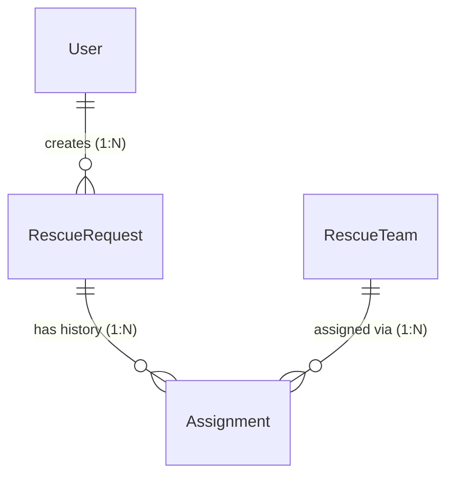

# Database Design

## 1. Overview

This document outlines the core database entities and entity relationships for the flood rescue coordination and relief management system.

---

## 2. Core Entities

### User
Represents system users (Citizens, Rescue Coordinators, Rescue Team members/leaders).
- Creates rescue requests when seeking emergency assistance.

### RescueRequest
Represents an emergency rescue request created by a Citizen.
- **Status Lifecycle**: Strictly references the state machine defined in [`docs/state-machine.md`](file:///c:/C%E1%BB%A9u%20tr%E1%BB%A3%20l%C5%A9%20l%E1%BB%A5t/c-u-h-vi-t/docs/state-machine.md). The status lifecycle includes:
  - `CREATED`
  - `VERIFYING`
  - `INVALID`
  - `VERIFIED`
  - `PRIORITIZED`
  - `WAITING_FOR_TEAM`
  - `ASSIGNED`
  - `ACCEPTED`
  - `IN_PROGRESS`
  - `COMPLETED`
  - `RESCUE_FAILED`
  - `CANCELLED`

### RescueTeam
Represents an operational rescue team dispatched to handle rescue requests.

### Assignment
Represents the link between a `RescueRequest` and a `RescueTeam`.
- Captures the complete history of team assignments, rejections, and re-assignments for a given rescue request.

---

## 3. Relationships

- **User ───── (1:N) ───── RescueRequest**: One `User` can create many `RescueRequest` entries.
- **RescueRequest ───── (1:N) ───── Assignment**: One `RescueRequest` can have multiple `Assignment` records over its lifecycle to retain historical assignments.
- **RescueTeam ───── (1:N) ───── Assignment**: One `RescueTeam` can be assigned to multiple `Assignment` records over time.

---

## 4. High-Level Entity-Relationship Diagram (ERD)

---

## 5. Detailed Entity Data Models

### 5.1. User
Represents system users including Citizens, Rescue Coordinators, and Rescue Team members.

| Column Name | Data Type | Primary Key | Foreign Key | Required / Optional | Description |
|---|---|---|---|---|---|
| `id` | VARCHAR(36) | Yes | No | Required | Unique identifier for User (UUID) |
| `name` | VARCHAR(255) | No | No | Required | Full name of the user |
| `phone` | VARCHAR(20) | No | No | Required | Primary contact phone number |
| `email` | VARCHAR(255) | No | No | Optional | Email address for account/notifications |
| `password` | VARCHAR(255) | No | No | Required | Hashed password string |
| `role` | VARCHAR(50) | No | No | Required | System role (`CITIZEN`, `COORDINATOR`, `TEAM_MEMBER`, `ADMIN`) |
| `created_at` | DATETIME | No | No | Required | Record creation timestamp |
| `updated_at` | DATETIME | No | No | Required | Record last update timestamp |

---

### 5.2. RescueRequest
Represents emergency rescue requests created by citizens.

| Column Name | Data Type | Primary Key | Foreign Key | Required / Optional | Description |
|---|---|---|---|---|---|
| `id` | VARCHAR(36) | Yes | No | Required | Unique identifier for RescueRequest (UUID) |
| `requester_id` | VARCHAR(36) | No | Yes | Required | References `User.id` (Citizen submitting the request) |
| `location_address` | VARCHAR(500) | No | No | Required | Human-readable address or situation location description |
| `latitude` | DECIMAL(10, 7) | No | No | Optional | Geographic latitude coordinate for distance calculation |
| `longitude` | DECIMAL(10, 7) | No | No | Optional | Geographic longitude coordinate for distance calculation |
| `people_count` | INT | No | No | Required | Number of people needing rescue |
| `description` | TEXT | No | No | Optional | Detailed situation description or special rescue needs |
| `priority` | VARCHAR(50) | No | No | Optional | Priority level (`LOW`, `MEDIUM`, `HIGH`, `CRITICAL`) |
| `status` | VARCHAR(50) | No | No | Required | Request lifecycle status (strictly follows [`docs/state-machine.md`](file:///c:/C%E1%BB%A9u%20tr%E1%BB%A3%20l%C5%A9%20l%E1%BB%A5t/c-u-h-vi-t/docs/state-machine.md)) |
| `created_at` | DATETIME | No | No | Required | Record creation timestamp |
| `updated_at` | DATETIME | No | No | Required | Record last update timestamp |

---

### 5.3. RescueTeam
Represents operational rescue teams dispatched to handle rescue requests.

| Column Name | Data Type | Primary Key | Foreign Key | Required / Optional | Description |
|---|---|---|---|---|---|
| `id` | VARCHAR(36) | Yes | No | Required | Unique identifier for RescueTeam (UUID) |
| `name` | VARCHAR(255) | No | No | Required | Name of the rescue team/unit |
| `status` | VARCHAR(50) | No | No | Required | Team status (`AVAILABLE`, `ON_MISSION`, `OFFLINE`) |
| `capacity` | INT | No | No | Required | Max number of people team can evacuate per mission |
| `capability` | VARCHAR(255) | No | No | Optional | Team specializations/equipment (e.g. Boat, Medical) |
| `created_at` | DATETIME | No | No | Required | Record creation timestamp |
| `updated_at` | DATETIME | No | No | Required | Record last update timestamp |

---

### 5.4. Assignment
Represents historical and active team assignments to a rescue request.

| Column Name | Data Type | Primary Key | Foreign Key | Required / Optional | Description |
|---|---|---|---|---|---|
| `id` | VARCHAR(36) | Yes | No | Required | Unique identifier for Assignment (UUID) |
| `rescue_request_id` | VARCHAR(36) | No | Yes | Required | References `RescueRequest.id` |
| `rescue_team_id` | VARCHAR(36) | No | Yes | Required | References `RescueTeam.id` |
| `status` | VARCHAR(50) | No | No | Required | Assignment status (`ASSIGNED`, `ACCEPTED`, `REJECTED`, `FAILED`, `COMPLETED`, `CANCELLED`) |
| `assigned_at` | DATETIME | No | No | Required | Timestamp when team was assigned by coordinator |
| `accepted_at` | DATETIME | No | No | Optional | Timestamp when team accepted the mission |
| `rejected_at` | DATETIME | No | No | Optional | Timestamp when team rejected the mission |
| `created_at` | DATETIME | No | No | Required | Record creation timestamp |
| `updated_at` | DATETIME | No | No | Required | Record last update timestamp |

---

## 6. Primary Key & Foreign Key Summary

| Child Entity | Foreign Key Column | Parent Entity | Referenced Primary Key | Relationship Type |
|---|---|---|---|---|
| `RescueRequest` | `requester_id` | `User` | `id` | Many-to-One (1 User : N RescueRequests) |
| `Assignment` | `rescue_request_id` | `RescueRequest` | `id` | Many-to-One (1 RescueRequest : N Assignments) |
| `Assignment` | `rescue_team_id` | `RescueTeam` | `id` | Many-to-One (1 RescueTeam : N Assignments) |

---

## 7. Indexing Strategy

Recommended database indexes for query performance optimization:

### 7.1. RescueRequest Indexes
- `idx_rescuerequest_requester_id` (`requester_id`): Fast retrieval of requests by citizen/user.
- `idx_rescuerequest_status` (`status`): Efficient filtering for Coordinator dashboard queues (e.g. `WAITING_FOR_TEAM`, `VERIFIED`).
- `idx_rescuerequest_priority` (`priority`): Priority-based sorting and queue management.
- `idx_rescuerequest_coords` (`latitude`, `longitude`): Geographic range queries for calculating distance to rescue teams.

### 7.2. Assignment Indexes
- `idx_assignment_rescue_request_id` (`rescue_request_id`): Fast lookup of assignment history per request.
- `idx_assignment_rescue_team_id` (`rescue_team_id`): Fast lookup of active and historical assignments per team.
- `idx_assignment_status` (`status`): Filtering active vs historical assignment records.

---

## 8. Assumptions & Ambiguities

1. **Primary Key Strategy**: All entities use `VARCHAR(36)` (UUID) as primary keys for distributed readiness and frontend key safety.
2. **User Email Optionality**: `phone` is required for emergency contact, while `email` is optional so citizens without email can register/request help.
3. **RescueRequest Priority**: `priority` is optional upon request creation (`CREATED`) and is set by a Rescue Coordinator when the request moves to `PRIORITIZED`.
4. **RescueRequest Physical Location**: Split into `location_address` (VARCHAR(500)), `latitude` (DECIMAL(10,7)), and `longitude` (DECIMAL(10,7)) to support exact geographic distance calculation and team matching (`BR-04`).
5. **RescueRequest Status**: `status` field values strictly follow the state machine lifecycle defined in [`docs/state-machine.md`](file:///c:/C%E1%BB%A9u%20tr%E1%BB%A3%20l%C5%A9%20l%E1%BB%A5t/c-u-h-vi-t/docs/state-machine.md).
6. **Active Assignment Rule**: At any given time, a `RescueRequest` can have at most one active `Assignment` record (where `status` is in `ASSIGNED` or `ACCEPTED`). Historical assignments are retained with status `REJECTED`, `FAILED`, `COMPLETED`, or `CANCELLED`.

